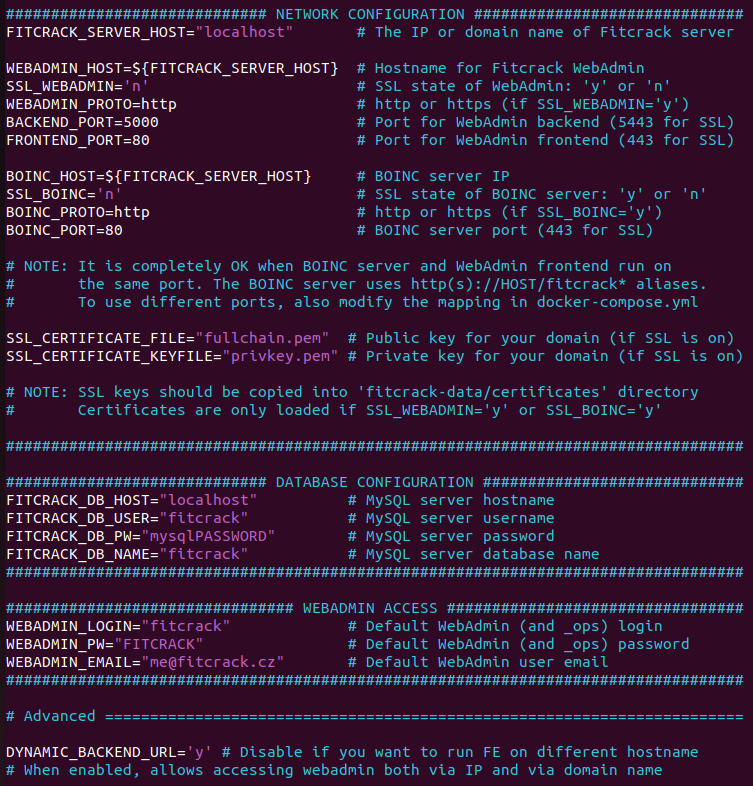
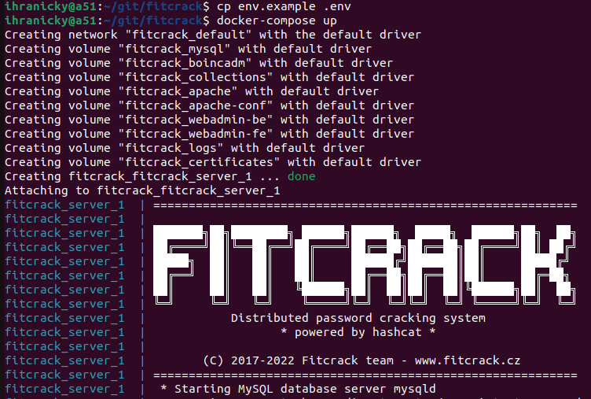

# Deploying Fitcrack server using Docker

This document describes how to install Fitcrack server using Docker.

### Requirements
Install **Docker Engine 20.10.x**. See instructions for you distro here: [https://docs.docker.com/engine/install/](https://docs.docker.com/engine/install/)

Install **docker-compose 1.29.x**. You can use the following command:
```
sudo curl -L "https://github.com/docker/compose/releases/download/1.29.2/docker-compose-$(uname -s)-$(uname -m)" -o /usr/local/bin/docker-compose
```

**NOTE:** Stick with the recommended versions if possible. Older versions may not work. Newer releases were not tested.

### Preparing the .env configuration file
Create a new **.env** config file from the example attached:
```
cp env.example .env
```

### Building Fitcrack image
In case you are not using a pre-built **fitcrack_server** image, build your own with:
```
docker-compose build
```



Edit the newly-created **.env** file and configure:
- `FITCRACK_SERVER_HOST` to the domain name or IP of your host machine
- In most cases, it is fine to default ports: `80` for the WebAdmin frontend and the BOINC server, and `5000`for the WebAdmin backend. But you can change them if you want.
- It is **recommended** to change the MySQL password `FITCRACK_DB_PW`.
- The default WebAdmin login is `fitcrack`/`FITCRACK`. We **highly recommend** to change it by modifying the `WEBADMIN_LOGIN` and `WEBADMIN_PW` variables.
- SSL is disabled by default. If you want to enable it, follow the instructions below.


### Starting the fitcrack_server container
Once the `fitcrack_server` image is prepared and `.env` file configured, you can run the server container using:
```
docker-compose up
```



This is fine for debugging. For serious use, you may want the container to run on background.
This can be dome by starting the container in the detached mode:
```
docker-compose up -d
```

For the very first run, the entrypoint will install the Fitcrack project which may take a couple of minutes.
For next runs (in case you restart the container), it will automatically load the previous installation
from the host-stored volumes.

Once installed, you should be able to access the WebAdmin using:
`http(s)://FITCRACK_SERVER_HOST:FRONTEND_PORT` that is `http://localhost` with default settings.

Hosts may connect using BOINC client, as described in [How to connect new hosts](https://nesfit.github.io/fitcrack/#/guide/hosts?id=connecting-hosts)
For connection, you should use the `http(s)://FITCRACK_SERVER_HOST:BOINC_PORT/fitcrack`.
In case localhost is used , the BOINC client needs to connect to
`http://127.0.0.1/fitcrack` with default settings.


### Configuring SSL (Optional)

To configure SSL on Fitcrack, you should first get a domain.
Then, you need to obtain a valid certificate for your
domain name. You can get one from [LetsEncrypt](https://letsencrypt.org/)
or any other trusted certificate issuer.

It is also possible to use a self-signed certificate, **but** you may need
to force **your browser** and the **BOINC client on all your hosts**
to trust the certificate. Otherwise they would not be able to connect.

First, remove **any previous installations** of Fitcrack server:
```
./remove_docker_installation.sh
```

Create a directory named `./fitcrack-data/certificates` in your installation
directory. Make sure to set the permissions right that the docker-compose
can access the files. Copy the certificate and associated private key file
in PEM format into the directory:
```
cp fullchain.pem ./fitcrack-data/certificates/
cp privkey.pem ./fitcrack-data/certificates/
```
Now, you can configure SSL in the `.env` file.

Configure Fitcrack server hostname to **your domain name**:
```
FITCRACK_SERVER_HOST="my.fitcrack.com"  # The IP or domain name of Fitcrack server
```

Configure the certificate and private key file names if they are different from above:
```
SSL_CERTIFICATE_FILE="fullchain.pem"  # Public key for your domain (if SSL is on)
SSL_CERTIFICATE_KEYFILE="privkey.pem" # Private key for your domain (if SSL is on)
```

Enable SSL for the WebAdmin:
```
SSL_WEBADMIN='y'      # SSL state of WebAdmin: 'y' or 'n'
WEBADMIN_PROTO=https  # http or https (if SSL_WEBADMIN='y')
BACKEND_PORT=5443     # Port for WebAdmin backend (5443 for SSL)
FRONTEND_PORT=443     # Port for WebAdmin frontend (443 for SSL)
```

Enable SSL for the BOINC server:
```
SSL_BOINC='y'      # SSL state of BOINC server: 'y' or 'n'
BOINC_PROTO=https  # http or https (if SSL_BOINC='y')
BOINC_PORT=443     # BOINC server port (443 for SSL)
```

Install and run the Fitcrack server:
```
docker-compose up
```

Check if you can access WebAdmin: `https://your.domain/`.
Check if you can connect a new host by adding
`https://your.domain/fitcrack` project using BOINC Manager/Client.

**NOTE:** It is also possible to enable SSL to WebAdmin or BOINC client only,
if this is what you want for your use-case.

<a name="debugging"></a>
### Debugging
Many of reported issues were caused by improper network configuration.
To debug connectivity issues, we recommend removing previous installation with `./remove_docker_installation.sh`
and making a fresh one with default settings from `env.example`.
Also, make sure no other web server is running on port `80` of your machine.
If your Fitcrack server does not work even with the default settings, the problem
is most likely in your Docker environment.
Thus, check if you have appropriate versions of **Docker Engine** and **docker-compose**.
We also recommend to use `docker-compose up` without the `-d` parameter for debugging
so that you can see what is happening during the installation.

Once you get Fitcrack running with default settings, you may experiment with
modifications of the `.env` variables. Whenever you modify the variables, you should
reinstall the Fitcrack server, i.e., remove the running container and volumes
using `./remove_docker_installation.sh` and stsart over to apply changes.

For debugging WebAdmin, you should
first check if the backend is running, e.g.: `http://localhost:5000`.
You can also check the frontend configuration file `http://localhost/static/configuration.js`
if it is connecting to the proper address. By default, backend's hostname is taken
from you browser URL hostname. This can be disabled using the `DYNAMIC_BACKEND_URL` variable.

For debugging BOINC server, check if the hostname, protocol and ports are set properly
on both server and client machines. With default settings, BOINC clients should
connect to the project server at `http://127.0.0.1/fitcrack`. In case of connectivity issues,
check that the hostname/IP are correct. Also, see if all daemons are running
on the WebAdmin: System - **Server monitor** page.

Also, you can check the `/fitcrack-data/logs` directory and browse logs
of individual server components, e.g. WebAdmin backend log, Work Generator log, etc.

For more advanced debugging, you may descend directly into the running Fitcrack container.
Check `docker ps -a` to see the container ID and type `docker exec -it <CONTAINERID> /bin/bash`
to enter the shell. Check if the daemons are running using `service fitcrack status`.
Check if Apache is running using `service apache2 status`. The BOINC project installation
is located at `/home/boincadm/projects/fitcrack`. Apache configs are found at
`/etc/apache2`. WebAdmin frontend is located in `/var/www/html/fitcrackFE` and backend
in `/var/www/html/fitcrackAPI`. Good luck!


### Removing existing installation
To remove an existing installation, you should delete the `fitcrack_server` container and all related volumes.
To automate the process, you can run:
```
./remove_docker_installation.sh
```
