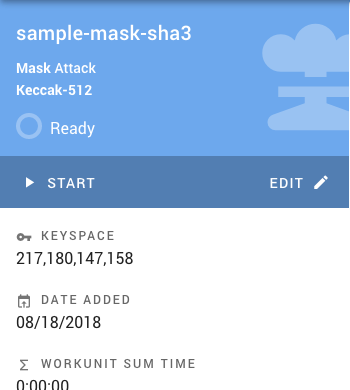

Job Detail
==========

The job detail view is where you find everything there is to know about a specific job. From its setup to the passwords found, you can see statistics, breakdowns, logs from participating hosts and much more.

Main Info Panel
---------------

The main panel shows most of the information on the job setup, current state, progress and more. It is also where you'll find the main controls for starting, stopping and other operations for the job.

> For more on these controls, see [Controlling Jobs](/jobs/managing/actions.md).

The top area where the name is has different colors depending on the current state of the job, so that you can tell what's happening at a glance. Here you can also open the edit dialog, which allows you to change the job's name, description (comment) and reschedule its start and end times.

Attack Info and Hashes
----------------------

The Details panel varies based on the attack mode used. It shows you how the attack was set up, for example what dictionaries are being used for a dictionary attack. It also shows the hashes being cracked. When a password is found, you'll see it next to its hash. A history of the job status is shown in a timeline along the top, with the option to _purge_ the job (see [this](system/settings.md) as well) and return it to a fresh state.

Hosts and Their Contribution
----------------------------

The Hosts panel shows a table of hosts assigned to the job. At the bottom of the table, you can open the host assignment dialog and make changes. The contribution chart is also shown, breaking down each host's contribution to the job by the amount of passwords tried.

Stat Graphs
-----------

Various statistics are aggregated while the job is running. These are then displayed in the form of different kinds of graphs. You can see how the job has progressed in time, for example, or see how the workunits were distributed between different host nodes.

Workunits and Logs
------------------

At the bottom of the page is a workunit table. It shows an overview of all the workunits in the job as a bar graphic, with a thorough breakdown in a table below, including complete logs for each workunit's run.
